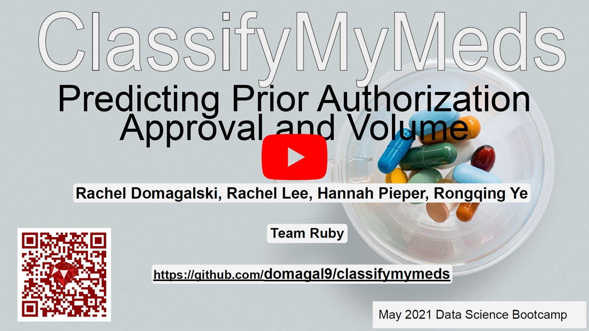
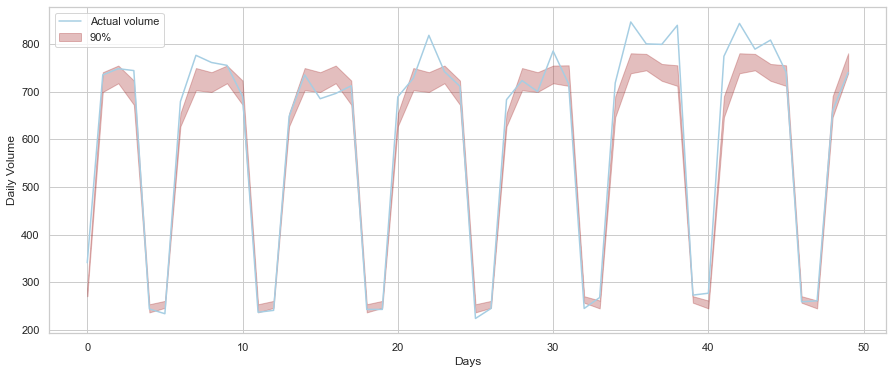
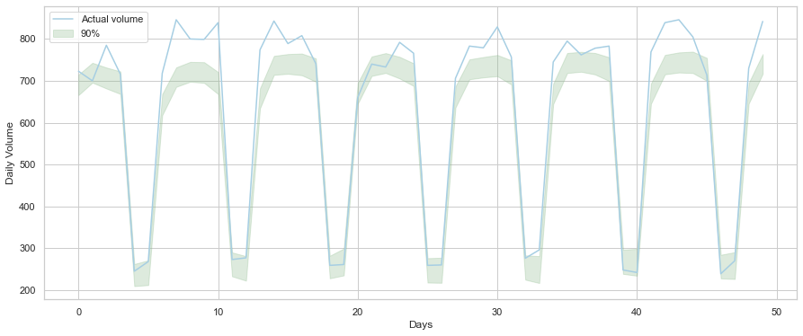

# ClassifyMyMeds: Predicting Prior Authorization Approval and Volume for CoverMyMeds
## CoverMyMeds Challenge at The Erdos Institute 2021 Boot Camp
Rachel Domagalski, Rachel Lee, Hannah Pieper and Rongqing Ye

## Overview 
[Project Description](#project-description)  
[Main Takeaways](#main-takeaways)  
[CoverMyMeds Data](#covermymeds-data)  
[Predicting PA Acceptance](#predicting-pa-acceptance)  
[Predicting PA and Claim Volume](#predicting-pa-and-claim-volume)  
[Identifying the Formulary for Each Payer](#identifying-the-formulary-for-each-payer)  
[Predicting the Limitation of Fills](#predicting-the-limitation-of-fills)  

## Project Description

When a patient tries to get a prescription from a pharmacy, a claim is created against the patient's insurance (payer). Such a pharmacy claim might be rejected for various reasons and might require prior authorization (PA). A PA is a form that providers submit on behalf of a patient to the insurance making a case for the prescribed therapy. In this project, we surveyed many classifiers for predicting how likely a certain PA will be approved, and forecast future volume of PAs with time series analysis techniques. Additionally, we identify the formulary for each payer and predict the number of times certain drugs can be refilled.

### Main Takeaways
- With highest ROC AUC, drop feature and permutation importance score, a random forest model should be used to predict prior authorization classification. [Predicting PA Acceptance](#predicting-pa-acceptance)
- Additive exponential smoothing provides an accurate forecast for monthly volume of PAs. [Predicting PA and Claim Volume](#predicting-pa-and-claim-volume)
- Random Forest and LSTM provide an accurate forecast for daily volume of PAs. [Predicting PA and Claim Volume](#predicting-pa-and-claim-volume)
- The formulary for each payer is identified. [Identifying the Formulary for Each Payer](#identifying-the-formulary-for-each-payer)
- We can predict the limitation on the number of refills for a drug. [Predicting the Limitation of Fills](#predicting-the-limitation-of-fills)  

### CoverMyMeds Data 
The simulated dataset was a challenge provided by [CoverMyMeds](https://covermymeds.com/). It contains over one million generated entries of simulated pharmacy claims data, spanning the years 2016, 2017, and 2018. 
Each event in the dataset corresponds to a prescription written by a provider. For each event, there is information about the patient's insurer, the patient's medical situation, the drug prescribed, and whether or not the original prescription claim was accepted. If it was rejected, the reject code is included, as well as whether the subsequent PA was accepted or rejected. Additionally, the month, day and year of the claim is included. Roughly half of the entries require a PA. 

All of the features for each event are categorical or binary; there are no continuous features. 
The date information provided in [data/dim_date.csv](data/dim_date.csv) contains information about when the pharmacy claim was submitted. In addition to the calendar date, it also includes whether this date was a weekday, workday, or holiday.   

The claims information provided in [data/dim_claims.csv](data/dim_claims.csv) contains the BIN for the payer, which drug was prescribed, the rejection code, and a flag if the pharmacy claim was approved. There are four payers: 417380, 417614, 417740, 999001, three drugs: A, B, C, and three reject codes: 70, 75, 76. To see which drugs are on the formulary for each payer, see [Identifying the Formulary for Each Payer](#identifying-the-formulary-for-each-payer).  

Prior authorization information is available in [data/dim_pa.csv](data/dim_pa.csv). Here we can learn for each prior authorization whether the patient has the correct diagnosis, has tried and failed generic alternatives, or has any associated contraindications for the requested medication. Also included is a flag for whether the prior authorization was favorably reviewed and approved. 

For information and summary of this dataset, see [exploration.ipynb](exploration.ipynb)

## Predicting PA Acceptance 

Not all prior authorizations (PA) get approved. It is extremely useful to know whether a PA is accepted because it can save doctors' time and help patients get their treatment in time. We evaluate a list of models on all possible non-empty feature subsets using various scoring functions in [pa_classifier.ipynb](pa_classifier.ipynb):

- models: logistic regression, decision tree, random forest, support vector classifier, voting classifier (using the previous 4 models), and AdaBoost classifier on decision tree with depth 1.
- feature subsets: all non-empty subsets of [bin, drug, correct_diagnosis, tried_and_failed, contraindication]. See [exploration.ipynb](exploration.ipynb) for their meanings.
- scoring functions: accuracy, precision, recall, f1, roc auc

We construct a baseline model that always predicts a PA will be approved. By comparing the scores of the other models to the baseline model, we see that the roc auc score is the better for selecting models. If a PA is approved, we want our model to confirm it, so that patients are sure to get their treatment. We want high true positive rate, or recall, of our models. If a PA is denied, we want our model to detect it, so doctors can alter the course of treatment immediately. We want high true negative rate as well. In binary classification, roc auc score is the average of true positive rate and true negative rate. Therefore, roc auc score is the most suitable score for selecting models.

Let's look at the best models in roc auc score:

From the table, we see that all scores but roc auc for the baseline model are relatively high. The roc auc score for the baseline model is 0.5, so it is basically a random guessing model. Decision tree and random forest are the best model in roc auc score. In [pa_classifier_feature_importances.ipynb](pa_classifier_feature_importances.ipynb), we use drop-feature importances to decide that random forest is better than decision tree. Additionally, we examine the statistical significance of these results by using bootstrap samples to construct confidence intervals around each of the performance scores. See [CMM_model_assessment.ipynb](CMM_model_assessment.ipynb) for details. 

We turn our random forest model into a Heroku app: [https://pachecker.herokuapp.com](https://pachecker.herokuapp.com). It includes the formulary found in [exploration.ipynb](exploration.ipynb). So it can tell whether a patient needs a prior authorization, and decides the probability of the PA being accepted. Source code and details of the app are located at [wormtooth/pachecker](https://github.com/wormtooth/pachecker).

## Predicting PA and Claim Volume 
For healthcare technology companies, knowing the prior authorization volume is a predictor of revenue. We use a variety of time series analysis approaches to find the best predictor of PA volume at the monthly level. This will assist in budgeting and resource allocation. 

- models: exponential smoothing, simple exponential smoothing, Holt's method, ARIMA
- features: calendar date, is_weekday, is_workday, is_holiday. 
- scoring functions: mean square error (MSE) and 95% prediction intervals

We find that the exponential smoothing model with an additive damped trend and additive seasonal period of length 12 has the lowest MSE. When training on a subset of the first 2.5 years of the data, the forecasted last 6 months has a 95% chance of being within 5.04% of the true number of PAs filed monthly. See [volumeCI.ipynb](volumeCI.ipynb).

We also used random forest regression and LSTM to obtain daily volume forecast. For random forest regression, we used the features that contained information about each date (for example, 'is_workday', 'is_weekday'). However, because these features do not account for differences between years, we had to normalize by the total PA volume of each year. With this approach, we obtain an accuracy of almost 95% with RMSE of 38 (daily PA volume approximately ranges from 200 to 800). The below shows a plot of the actual data (blue line) with the prediction interval (brown area) for the last 50 days of 2019.

We also used Long Short Term Memory (LTSM) model to obtain daily volume prediction. With epoch number of 40, (input) drop out rate of 0.0, and look back of 28 days, we acheived approximately 91% of accuracy with 40 RMSE averaged over 100 repetitions. Thus we obtain lower accuracy and higher RMSE with LTSM compared to the above approach but it is worth to notice with this approach, prior knowledge of yearly PA volume is not required. The plot below shows the actual data (blue line) with possible interval for the prediction values (green area). Notice the coloured area does not represent prediction area. It was rather needed as the prediction values of LSTM model tend to vary due to the stochastic nature of the model.

The composite of the daily predictions for each day of a given month can of course generate a monthly prediction as well.

## Identifying the Formulary for Each Payer 
The formulary of a payer is list of the preferred drugs each payer has. These lists are often tiered with certain drugs being lower in cost than others, and other drugs needing a prior authorization before the payer will agree to cover them. If an initial pharmacy claim is rejected, a "reject code" is provided which explains why the drug was not covered. In this data, we have three different reject codes: 
* 70: the drug is not on the formulary and is not covered by the payer;
* 75: the drug is on the formulary, but another drug is typically preferred;
* 76: the drug is covered but plan limitations ahve been exceeded.
A presciption fill request with reject code 75 requires a prior authorization and a code 76 typically means the patient has exceeded the number of refills for the medication.

We determine the formulary of each payer from these codes. In particular, by examining the data from each payer and each drug, we find the following: 
* Payer 417380: Drug A is on formulary, but requires a PA (Code 75), Drug B is on formulary and only requires a PA if the patient is over refills (Code 76), Drug C is not covered (Code 70).
* Payer 417614: Drug A is not covered (Code 70), Drug B is on formulary but requires a PA (Code 75), Drug C is on formulary and only requires a PA if patient is over refills (Code 76). 
* Payer 417740: Drug A is on formulary and only requires a PA if patient is over refills (Code 76), Drug B is not covered (Code 70), Drug C is on formulary but requires a PA (Code 75). 
* Payer 999001: All drugs are on formulary and only require a PA if patient is over refills (Code 76). 

These results can be observed in [exploration.ipynb](exploration.ipynb)

## Predicting the Limitation of Fills

A reject code 76 occurs if a patient fills a certain drug too many times and exceeds the number of allowed fills. For example, if a payer decides drug X can be refilled 5 times, then a patient with this payer can refill their prescription 5 times without any issue. However, when the patient tries to refill their medication for the sixth time, the request gets rejected with code 76.

Assuming that the numbers of fills for drug X obeys a Poisson distribution, we can infer the relation between limitation of fills and the average number of fills from the data:

| Average | Limitation |
| ------- | ---------- |
| 4       | 7          |
| 5       | 9          |
| 6       | 10         |
| 7       | 11         |
| 8       | 12         |

The table is taken from [number_of_fills.ipynb](number_of_fills.ipynb). If the average number of fills for the drug X is 4, then the limitation of fills inferred from the data is 7. Under the assumption of Poisson distribution, the best estimate is that the average number of fills is 7 and the limitation of fills is 11.

The estimate is helpful for payers to make strategy on limitation of fills to balance the cost between processing prior authorization and approving the drug X. Currently, 10% of pharmacy claims for drug X require prior authorizations. Using the best estimate of average number of fills being 7, we conclude that increasing the limitation of fills to 12 can reduce the volume of prior authorizations in half. That is, only 5% of pharmacy claims for drug X now require prior authorizations. It cuts the cost of processing prior authorization in half! Of course, it increases the cost from approving the drug X at the same time.

See [number_of_fills.ipynb](number_of_fills.ipynb) for more details.

